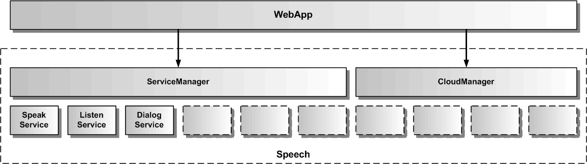

# Gesamtarchitektur von Speech

Die Speech Architektur umfasst verschiedene Services, die jeweils ein API für ein Feature von Speech für die eigene WebApp zur Verfügung stellen.

## Services

Der BotService verwendet die anderen Services und kombiniert sie zu einer komplexen Dialogfunktionalität.
Der SpeakService dient zur Sprachausgabe von einzelnen Texten. Dazu verwendet er seinerseits entweder Sprachsynthese oder Audiodateien. Der ListenService dient zur Spracheingabe. Dazu verwendet er seinerseits Spracherkennung. Der IntentService dient zur Sprachanalyse von Texten, um deren Intention herauszufinden. Für die Sprachanalyse wird eine NLU mit einem Sprachmodell benötigt. Je nach verwendeter NLU, ob lokal oder cloudbasiert, muss das Sprachmodell über eine Web-Anwendung beim NLU-Anbieter für die eigene App erstellt werden. Zusätzlich benötigt man einen Account beim NLU-Anbieter. Der DialogService dient zur Ausführung von Dialogskripten.
Der ActionService dient zur Weiterleitung von Aktionen aus dem Bot an konkrete Funktionen oder Komponenten der AngularApp. Der AmazonService, GoogleService, MicrosoftService und RasaService erlauben jeweils die Änderung ihrer Credentials. Die WebApp kann jeden Service unabhängig von den anderen Services nutzen. [Hier](./../../packages/ServiceList.md) werden alle Services beschrieben.

## Module

Neben den Services, die direkt in Angular eingebunden werden, gibt es auch noch Module, die Speech um spezielle Funktionalität ergänzen. Das AmazonModule bindet den Amazon Cloud-Dienst in Speech ein und macht für den SpeakService die Amazon-TTS (Polly) verfügbar. Das MicrosoftModule bindet den Microsoft Cloud-Dienst ein und macht für den ListenService die Microsoft-ASR verfügbar. Das GoogleModule bindet den Google Cloud-Dienst ein und macht für den IntentService die Google-NLU (Dialogflow Version 1) verfügbar.
Das RasaModule bindet den Rasa Cloud-Dienst ein und macht für den IntentService die Rasa-NLU verfügbar und erlaubt den Betrieb eines eigenen Rasa-Servers. [Hier](./../../packages/CloudList.md) werden die eingebundenen Cloud-Dienste beschrieben.
