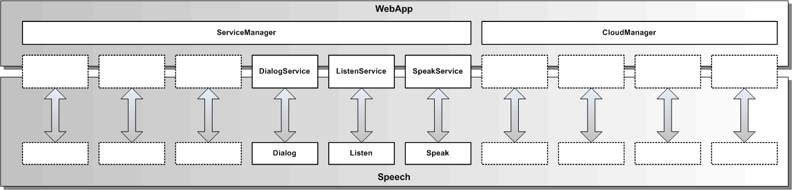

# Speech Services

Die Speech Services kapseln die Speech Komponenten vollständig und definieren eine öffentliche Speech-Service API für eine WebApp.

Die Speech Services sind Service-Wrapperklassen für die gleichnamigen Speech Komponenten, wie in der oberen Grafik dargestellt.

In der folgenden Grafik werden die Vererbungsbeziehungen der Speech Service Klassen zur Service-Klasse und die Enthaltensein-Beziehungen zu den Speech Komponenten dargestellt.

Folgende Speech Services gibt es aktuell:

* **[ListenService](./listen/ListenService.md):** erlaubt die Spracheingabe und Umwandlung in Text

* **[SpeakService](./speak/SpeakService.md):** erlaubt die Sprachausgabe eines kurzen Textes

Folgende Basis Services gibt es:

* **[Service](./service/Service.md):** beinhaltet die gemeinsame Grundfunktionalität der Speech Services
