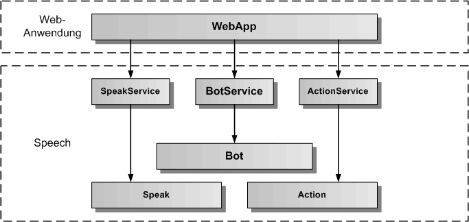
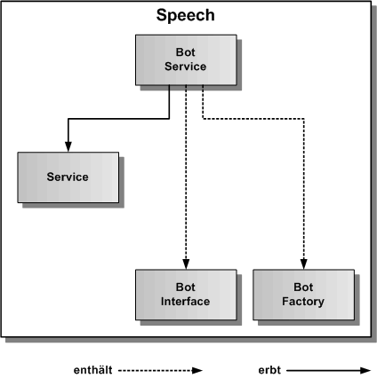
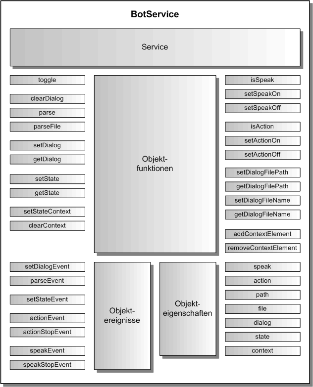

# BotService

Der BotService dient zum Abspielen von Dialogzuständen, die in einem Speech.def Skript abgelegt sind. Die Dialogzustände werden durch die WebApp gesetzt. Mit Hilfe der [Dialog-Definitionssprache](./DialogScript.md) lassen sich komplexe Dialoge definieren. Der BotService liefert Ereignisse an die WebApp zurück. Der BotService erbt vom abstrakten [Service](./../service/Service.md).

## Architektur

In der folgenden Grafik werden die einzelnen Schichten, angefangen von der WebApp, über den BotService, bis zur Bot-Komponente, Speak-Komponente und Action-Komponente von Speech, dargestellt. Die Bot-Komponente nutzt ihrerseits die Speak- und Action-Komponenten, um die Sprachausgabe und die Aktionsverarbeitung auszuführen. Auf diese Komponenten kann die WebApp über den [SpeakService](./../speak/SpeakService.md) und den [ActionService](./../action/ActionService.md) auch direkt zugreifen.  

Die nächste Grafik zeigt die konkrete Vererbungsbeziehung zu BaseService, sowie die Einbindung von BotFactory und BotInterface aus Speech. BotFactory ist eine statische Klasse und erzeugt das Bot-Objekt zum BotInterface. 

## API

Der BotService definiert die öffentliche Schnittstelle von Speech für die Dialogausführung. Die folgende Grafik zeigt einen Überblick über die gesamte API des BotServices. Die API teilt sich auf in Objektfunktionen, Objektereignisse und Objekteigenschaften. Die API verfügt über eine auf Funktionen und eine auf Eigenschaften basierende Schnittstelle. Die gleiche Aufgabe kann über Funktionsaufrufe oder über das Setzen von Eigenschaften erledigt werden. Z.B. kann der Dialogname entweder mit botService.setDialog('TestDialog') oder mit botService.dialog = 'TestDialog' eingetragen werden, bevor mit botService.start() die Dialogausführung gestartet wird.

## Importieren

Um den BotService importieren zu können, muss in der jeweiligen Komponente folgende Zeile eingefügt werden:

	import { BotService } from '@speech/bot';
	
Dazu müssen die Speech NPM-Pakete in der gleichen Version vorher ins eigene WebApp-Projekt kopiert und installiert worden sein.

	$ npm install speech-*-<version>.tgz

Alternativ können die Speech NPM-Pakete auch aus dem NPM-Repository geladen werden:

	$ npm install @speech/*
	 

## Konfiguration

Dier erste Aufgabe vor Nutzung des BotService besteht in der Festlegung der Konfiguration vor der Erzeugung des Services. In der Defaulteinstellung wird die init()-Funktion im Konstruktor aufgerufen und die voreingestellte Konfiguration übernommen. Will man die Defaultkonfiguration überschreiben, holt man sie sich mittels der Klassenfunktion BotService.getConfig(). Diese Funktion gibt das BotConfig-Objekt des BotServices zurück. 

Auszug aus der Datei: packages/bot/src/bot-service-config.ts:

	// hier sind die Defaultwerte des BotService festgelegt	
	export const BotServiceConfig: BotServiceOptionInterface = {
	    /** ein/ausschalten des Bot */
	    activeFlag: true,
	    /** ein/ausschalten der Sprachausgabe */
	    speakFlag: true,
	    /** ein/ausschalten der Aktionsverarbeitung */
	    actionFlag: true,
	    /** einzustellender Startdialog */
	    dialogName: 'main',
	    /** Startdialogzustand, wenn ein Dialog gestartet wird */
	    dialogRootState: 'home',
	    /** legt fest, ob ein Dialog direkt geladen wird */
	    dialogLoadFlag: true,
	    /** definiert das Verzeichnis fuer die Dialogdefinitionsdateien */
	    dialogFilePath: 'assets/',
	    /** Dialogdefinitionsdateiname fuer die erste zu ladende Dialogdefinitonsdatei */
	    dialogFileName: 'speech.def',
	    /** legt fest, ob die Fehlermeldungen zusaetzlich auf der Konsole ausgegeben werden */
	    errorOutputFlag: false
	};

## Dialogdatei einlesen

Bevor ein Dialog ausgeführt werden kann, muss die zugehörige Dialogskiptdatei erstellt und eingelesen werden. Wie eine Dialogskriptdatei erstellt wird, kann [hier](./DialogScript.md) nachgelesen werden. Hier beschäftigen wir uns mit den verschiedenen Möglichkeiten, eine Dialogskriptdatei einzulesen. Die erste Möglichkeit ist, die Dialogskriptdatei bei der Initialisierung des BotService einzulesen. Dies ist in der Konfiguration defaultmäßig durch Setzen des dialogLoadFlag auf true eingestellt. Daneben müssen aber auch das Dialogverzeichnis und die Dialogdatei richtig gesetzt sein. Nimmt man hier nicht die Defaulteinstellungen von dialogFilePath = 'assets/' und dialogFileName = 'speech.def' so muss man die Parameter in der Konfiguration selbst setzen, wie unter dem Abschnitt Konfiguration weiter oben beschrieben. Will man das Dialogskript komplett selbst verwalten kann man den Parameter dialogLoadFlag in der Konfiguration auf false setzen und die Dialogskriptdatei mit der parseFile()-Funktion einlesen. Alternativ kann man das Dialogskript als String im Code einfügen und über die parse()-Funktion einlesen. Ist das Dialogskript erfolgreich eingelesen worden, wird ein parseEvent ausgelöst. Bei einem Fehler wird ein errorEvent ausgelöst.

Angular Beispielkomponente zum manuellen Einlesen einer Dialogskriptdatei:
 
 	// Angular
 	
	import { Component, OnInit, OnDestroy } from '@angular/core';

	// BotService 
		
	import { BotService } from '@speech/bot';

	
	@Component({
		selector: 'app-bot',
		templateUrl: './bot.component.html',
		styleUrls: ['./bot.component.css']
	})
	export class BotComponent implements OnInit, OnDestroy {
	
		parseEvent = null;
		errorEvent = null;
	
		botService: BotService;
		
		constructor() {
			this.botService = new BotService();
		}
		
		// Bot-Ereignisse eintragen
				
		ngOnInit() {
			this.botService.init();
			this.parseEvent = this.botService.errorEvent.subscribe(aError => console.log('Dialogskript komplett eingelesen'));
			this.errorEvent = this.botService.errorEvent.subscribe(aError => console.log('Fehler:', aError.message));
		}

		// Bot-Ereignisse freigeben
		
		ngOnDestroy() {
			this.parseEvent.unsubscribe();
			this.errorEvent.unsubscribe();
		}

		// eigene Funktionen fuer das parsen eines Dialogskriptes in einer eigenen Angular-Komponente

		parse() {
			// wird kein eigener Dateiname als optionaler Parameter uebergeben, wird der Defaultname verwendet
			this.botService.parseFile();
		}

	}

## Dialog ausführen

Um einen Dialog auszuführen zu können, müssen zuerst der DialogName und dann der StatusName gesetzt werden.
Diese Namen müssen mit Namen aus dem aktuell eingelesenem Dialogskript übereinstimmen. Wird der Dialog gestartet, wird ein startEvent ausgelöst, wird der Dialog beendet wird ein stopEvent ausgelöst. Für jede Aktion und jede Sprachausgabe werden ebenfalls entsprechende Ereignisse ausgelöst.

Angular Beispiel-Komponente für das ausführen eines Dialogs:

	// Angular
	
	import { Component, OnInit, OnDestroy } from '@angular/core';

	// BotService 
		
	import { BotService } from '@speech/bot';

	
	@Component({
		selector: 'app-bot',
		templateUrl: './bot.component.html',
		styleUrls: ['./bot.component.css']
	})
	export class BotComponent implements OnInit, OnDestroy {
	
		startEvent = null;
		stopEvent = null;
		errorEvent = null;
	
		botService: BotService;
		
		
		
		constructor() {
			this.botService = new BotService();
		}
		
		// Bot-Ereignisse eintragen
				
		ngOnInit() {
			this.botService.init();
			this.startEvent = this.botService.startEvent.subscribe(() => console.log('Dialog gestartet'));
			this.stopEvent = this.botService.stopEvent.subscribe(() => console.log('Dialog beendet'));
			this.errorEvent = this.botService.errorEvent.subscribe(aError => console.log('Dialog Fehler:', aError.message));
		}

		// Bot-Ereignisse freigeben
		
		ngOnDestroy() {
			this.startEvent.unsubscribe();
			this.stopEvent.unsubscribe();
			this.errorEvent.unsubscribe();
		}

		// eigene Funktionen fuer die Dialogausfuehrung in einer eigenen Angular-Komponente

		dialog( aDialog: string, aState: string ) {
			this.botService.dialog = aDialog;
			this.botService.state = aState;
			this.botService.start();
		}
		
		dialogStop() {
			this.botService.stop();
		}

	}

## Sprachausgabe ein/ausschalten

Möchte man einen Dialog ohne Sprachausgabe ausführen, kann man die Sprachausgabe für den Bot ausschalten. Dies kann sowohl in der Konfiguration über den Parameter speakFlag gesetzt werden oder über die Speak-Funktionen/Eigenschaft.

	// Sprachausgabe einschalten per Funktion
	this.botService.setSpeakOn();
	// oder per Eigenschaft
	this.botService.speak = true;
	
	// Sprachausgabe ausschalten per Funktion
	this.botService.setSpeakOff();
	// oder per Eigenschaft
	this.botService.speak = false;
	
	// Abfrage auf Sprachausgabe per Funktion
	if ( this.botService.isSpeak()) { ... }
	// oder per Eigenschaft
	if ( this.botService.speak ) { ... }

## Aktionsverarbeitung ein/ausschalten

Möchte man einen Dialog ohne Aktionsverarbeitung ausführen, kann man die Aktionsverarbeitung für den Bot ausschalten. Dies kann sowohl in der Konfiguration über den Parameter actionFlag gesetzt werden oder über die Action-Funktionen/Eigenschaft.

	// Aktionsverarbeitung einschalten per Funktion
	this.botService.setActionOn();
	// oder per Eigenschaft
	this.botService.action = true;
	
	// Aktionsverarbeitung ausschalten per Funktion
	this.botService.setActionOff();
	// oder per Eigenschaft
	this.botService.action = false;
	
	// Abfrage auf Aktionsverarbeitung per Funktion
	if ( this.botService.isAction()) { ... }
	// oder per Eigenschaft
	if ( this.botService.action ) { ... }

