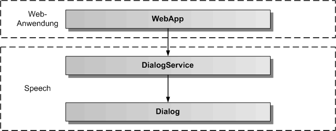
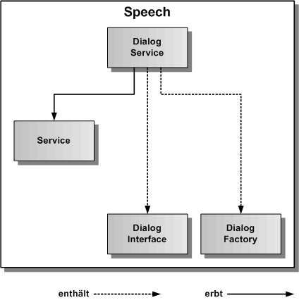
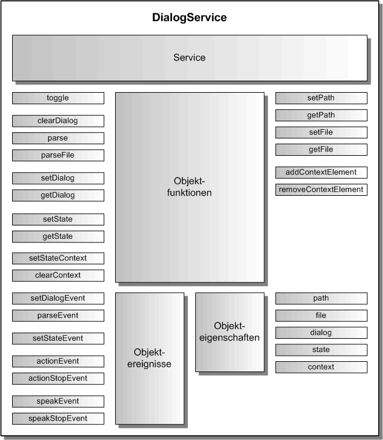

# DialogService

Der DialogService dient zum Abspielen von Dialogzuständen, die in einem Speech.def Skript abgelegt sind. Die Dialogzustände werden durch die WebApp gesetzt. Mit Hilfe der [Dialog-Definitionssprache](./DialogScript.md) lassen sich komplexe Dialoge definieren. Der DialogService liefert Ereignisse an die WebApp zurück. Der DialogService erbt vom abstrakten [Service](./../service/Service.md).

## Architektur

In der folgenden Grafik werden die einzelnen Schichten, angefangen von der WebApp, über den DialogService, bis zur Dialog-Komponente von Speech, dargestellt.

Die nächste Grafik zeigt die konkrete Vererbungsbeziehung zu Service, sowie die Einbindung von DialogFactory und DialogInterface aus Speech. DialogFactory ist eine statische Klasse und erzeugt das Dialog-Objekt zum DialogInterface. 

## API

Der DialogService definiert die öffentliche Schnittstelle von Speech für die Dialogausführung. Die folgende Grafik zeigt einen Überblick über die gesamte API des DialogServices. Die API teilt sich auf in Objektfunktionen, Objektereignisse und Objekteigenschaften. Die API verfügt über eine auf Funktionen und eine auf Eigenschaften basierende Schnittstelle. Die gleiche Aufgabe kann über Funktionsaufrufe oder über das Setzen von Eigenschaften erledigt werden. Z.B. kann der Dialogname entweder mit dialogService.setDialog('TestDialog') oder mit dialogService.dialog = 'TestDialog' eingetragen werden, bevor mit dialogService.start() die Dialogausführung gestartet wird.

## Importieren

Um den DialogService importieren zu können, muss in der jeweiligen Komponente folgende Zeile eingefügt werden:

	import { DialogService } from '@lingualogic-speech/dialog';
	
Dazu müssen die Speech NPM-Pakete in der gleichen Version vorher ins eigene WebApp-Projekt kopiert und installiert worden sein.

	$ npm install lingualogic-speech-*-<version>.tgz

Alternativ können die Speech NPM-Pakete auch aus dem NPM-Repository geladen werden:

	$ npm install @lingualogic-speech/*
 

## Konfiguration

Dier erste Aufgabe vor Nutzung des DialogService besteht in der Festlegung der Konfiguration vor der Erzeugung des Services. In der Defaulteinstellung wird die init()-Funktion im Konstruktor aufgerufen und die voreingestellte Konfiguration übernommen. Will man die Defaultkonfiguration überschreiben, holt man sie sich mittels der Klassenfunktion DialogService.getConfig(). Diese Funktion gibt das DialogConfig-Objekt des DialogServices zurück. 

Auszug aus der Datei: packages/dialog/src/dialog-service-config.ts:

	// hier sind die Defaultwerte des DialogService festgelegt	
	export const DialogServiceConfig: DialogServiceOptionInterface = {
	    /** ein/ausschalten des Dialogs */
	    activeFlag: true,
	    /** einzustellender Startdialog */
	    dialogName: 'main',
	    /** Startdialogzustand, wenn ein Dialog gestartet wird */
	    dialogRootState: 'home',
	    /** legt fest, ob ein Dialog direkt geladen wird */
	    dialogLoadFlag: true,
	    /** definiert das Verzeichnis fuer die Dialogdefinitionsdateien */
	    dialogFilePath: 'assets/',
	    /** Dialogdefinitionsdateiname fuer die erste zu ladende Dialogdefinitonsdatei */
	    dialogFileName: 'speech.def',
	    /** legt fest, ob die Fehlermeldungen zusaetzlich auf der Konsole ausgegeben werden */
	    errorOutputFlag: false
	};

## Dialogdatei einlesen

Bevor ein Dialog ausgeführt werden kann, muss die zugehörige Dialogskiptdatei erstellt und eingelesen werden. Wie eine Dialogskriptdatei erstellt wird, kann [hier](./DialogScript.md) nachgelesen werden. Hier beschäftigen wir uns mit den verschiedenen Möglichkeiten, eine Dialogskriptdatei einzulesen. Die erste Möglichkeit ist, die Dialogskriptdatei bei der Initialisierung des DialogService einzulesen. Dies ist in der Konfiguration defaultmäßig durch Setzen des dialogLoadFlag auf true eingestellt. Daneben müssen aber auch das Dialogverzeichnis und die Dialogdatei richtig gesetzt sein. Nimmt man hier nicht die Defaulteinstellungen von dialogFilePath = 'assets/' und dialogFileName = 'speech.def' so muss man die Parameter in der Konfiguration selbst setzen, wie unter dem Abschnitt Konfiguration weiter oben beschrieben. Will man das Dialogskript komplett selbst verwalten kann man den Parameter dialogLoadFlag in der Konfiguration auf false setzen und die Dialogskriptdatei mit der parseFile()-Funktion einlesen. Alternativ kann das Dialogskript als String im Code eingefügt und über die parse()-Funktion einlesen werden. Ist das Dialogskript erfolgreich eingelesen worden, wird ein parseEvent ausgelöst. Bei einem Fehler wird ein errorEvent ausgelöst.

Angular Beispielkomponente zum manuellen Einlesen einer Dialogskriptdatei:
 
 	// Angular
 	
	import { Component, OnInit, OnDestroy } from '@angular/core';

	// DialogService 
		
	import { DialogService } from '@lingualogic-speech/dialog';

	
	@Component({
		selector: 'app-dialog',
		templateUrl: './dialog.component.html',
		styleUrls: ['./dialog.component.css']
	})
	export class DialogComponent implements OnInit, OnDestroy {
	
		parseEvent = null;
		errorEvent = null;
		
		dialogService: DialogService;
	
		constructor() {
			this.dialogService = new DialogService();
		}
		
		// Dialog-Ereignisse eintragen
				
		ngOnInit() {
			this.dialogService.init();
			this.parseEvent = this.dialogService.errorEvent.subscribe(aError => console.log('Dialogskript komplett eingelesen'));
			this.errorEvent = this.dialogService.errorEvent.subscribe(aError => console.log('Fehler:', aError.message));
		}

		// Dialog-Ereignisse freigeben
		
		ngOnDestroy() {
			this.parseEvent.unsubscribe();
			this.errorEvent.unsubscribe();
		}

		// eigene Funktionen fuer das parsen eines Dialogskriptes in einer eigenen Angular-Komponente

		parse() {
			// wird kein eigener Dateiname als optionaler Parameter uebergeben, wird der Defaultname verwendet
			this.dialogService.parseFile();
		}

	}

## Dialog ausführen

Um einen Dialog auszuführen zu können, müssen zuerst der DialogName und dann der StatusName gesetzt werden.
Diese Namen müssen mit Namen aus dem aktuell eingelesenem Dialogskript übereinstimmen. Wird der Dialog gestartet, wird ein startEvent ausgelöst, wird der Dialog beendet wird ein stopEvent ausgelöst. Für jede Aktion und jede Sprachausgabe werden ebenfalls entsprechende Ereignisse ausgelöst.

Angular Beispiel-Komponente für das ausführen eines Dialogs:

	// Angular
	
	import { Component, OnInit, OnDestroy } from '@angular/core';

	// DialogService 
		
	import { DialogService } from '@lingualogic-speech/dialog';

	
	@Component({
		selector: 'app-dialog',
		templateUrl: './dialog.component.html',
		styleUrls: ['./dialog.component.css']
	})
	export class DialogComponent implements OnInit, OnDestroy {
	
		startEvent = null;
		stopEvent = null;
		errorEvent = null;
		
		dialogService: DialogService;
	
		constructor() {
			this.dialogService = new DialogService();
		}
		
		// Dialog-Ereignisse eintragen
				
		ngOnInit() {
			this.dialogService.init();
			this.startEvent = this.dialogService.startEvent.subscribe(() => console.log('Dialog gestartet'));
			this.stopEvent = this.dialogService.stopEvent.subscribe(() => console.log('Dialog beendet'));
			this.errorEvent = this.dialogService.errorEvent.subscribe(aError => console.log('Dialog Fehler:', aError.message));
		}

		// Dialog-Ereignisse freigeben
		
		ngOnDestroy() {
			this.startEvent.unsubscribe();
			this.stopEvent.unsubscribe();
			this.errorEvent.unsubscribe();
		}

		// eigene Funktionen fuer die Dialogausfuehrung in einer eigenen Angular-Komponente

		dialog( aDialog: string, aState: string ) {
			this.dialogService.dialog = aDialog;
			this.dialogService.state = aState;
			this.dialogService.start();
		}
		
		dialogStop() {
			this.dialogService.stop();
		}

	}
